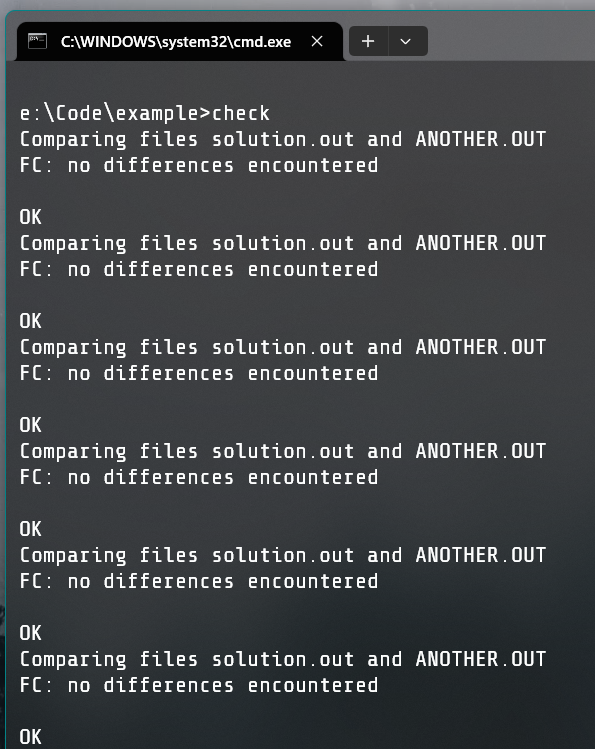

# 对拍

## 前言

!!! question "什么情况下要对拍"

    当下面三个条件都满足时，建议你写一个对拍：

    - 在考场上想出来了一道题目的正解；
    - 不确定自己的思路是否正确；
    - 这道题目是可以写暴力的。

!!! warning "注意事项"

    **暴力一定要写对！暴力一定要写对！暴力一定要写对！暴力一定要写对！**

    ~~不然就会像某人一样 9月8日 T3 虚空调试了半天。。。~~

    在开拍之前先在草稿纸上写一些你认为会卡的毒瘤数据，比如序列全 `0`、树退化成链、存在负环、菊花图挂了几条链等等情况，这些 corner cases 可以更好的帮助你调试。

## 实践

原题目 [CF55D](https://www.luogu.com.cn/problem/CF55D)。

首先建个文件夹，`solution.cpp` 是正解（代码太长了不放了，在[这里](https://codeforces.com/contest/55/submission/215657474)），`another.cpp` 是暴力，`generator.cpp` 是数据生成器。

下面是暴力：

``` cpp title="another.cpp"
#include <bits/stdc++.h>
using ll = long long;

int t;
ll l, r, ans;

bool check(ll x) {
    ll tmp = x;
    do {
        if(tmp % 10 != 0)
            if(x % (tmp % 10) != 0)
                return 0;
        tmp /= 10;
    } while(tmp);
    return 1;
}

int main() {
    std::cin >> t;
    for(int i = 1; i <= t; ++i) {
        std::cin >> l >> r;
        ans = 0;
        for(ll x = l; x <= r; ++x) {
            ans += check(x);
        }
        std::cout << ans << '\n';
    }
}
```

下面是数据生成器：

``` cpp title="generator.cpp"
#include <bits/stdc++.h>

using ll = long long;
// 注意下面声明的这两个东西都需要 C++11 或更新标准

std::mt19937_64 mt(std::chrono::steady_clock::now().time_since_epoch().count());
// (1)
// 说人话就是做了一个用时间作为种子的随机数生成器
// 那为什么不用 time(0) 呢？据我们机房 xgz 大佬说 time(0) 很慢

std::uniform_int_distribution<ll> dist;
// (2)
// 说人话就是用了这个可以让你的数据更均匀分布

ll rnd(ll l, ll r) { // (3)
    return dist(mt) % (r - l) + l; // (4)
}

int t;
ll l, r;
int main() {
    freopen("data.in", "w", stdout); // (5)

    t = rnd(1, 10);
    printf("%d\n", t);
    for(int i = 1; i <= t; ++i) {
        l = rnd(1, 10000); // 一开始可以拍小点，注意别让暴力跑太久
        r = rnd(l, l+100000);
        printf("%lld %lld\n", l, r);
    }
    fclose(stdout);
}
```

1. 数据生成器，`mt19937` 是梅森旋转算法，可以生成随机数，加 `_64` 可以生成更大的范围（编译器不支持就去掉）。
   `chrono::steady_clock` 是物理单调时钟，成员函数 `now()` 返回当前时钟值，`time_since_epoch()` 表示将这个 `time_point` 转换为它距离纪元的时间量，`count()` 则是把它转换为整数。
2. `uniform_int_distribution` 可以生成均匀分布的随机数（按照一个离散概率函数分布）。均匀分布的区间是构造函数传入的 $a$ 和 $b$（注意是闭区间而非 STL 中常见的左闭右开）。
    构造函数不传参数默认用模板函数类型的上界作为 $b$。
3. 返回 $[l, r)$ 中的随机数。
4. 这里生成随机数的方法是调用 `uniform_int_distribution` 的伪函数（传入 `mt19937` 生成器）。
5. 重定向至 `data.in`。

编译好这三个文件，生成二进制文件。

下面是对拍程序。

=== "Windows"

    创建 `check.bat`：

    ``` bat title="check.bat"
    :: 批处理文件的两个冒号是注释
    @echo off
    :: 不输出命令本身，控制台更整洁

    :: 下面这个声明了一个名为 LOOP 的 label
    :LOOP

    :: 造数据
    generator.exe

    :: 调用正解
    solution.exe
    :: 如果正解里面没用文件重定向可以在批处理里面用管道符
    :: 小于号定向输入，大于号定向输出
    :: 两个命令根据情况选执行哪个
    solution.exe < data.in > solution.out

    :: 调用暴力
    another.exe
    :: 管道版，同样二选一
    another.exe < data.in > another.out

    :: fc 来文件比较
    fc solution.out another.out

    :: errorlevel 是上一条命令的退出码，两个百分号就是取变量的值
    :: fc 在检测到文件差异时会返回非零值，这时候说明拍出错了
    :: neq 就是 not equal，不等于
    if %errorlevel% neq 0 (
        :: echo 输出到控制台
        echo WRONG_ANSWER
        :: 暂停批处理文件，此时可以打开 data.in 看看哪个数据卡掉了自己
        pause
    ) else (
        echo OK
    )

    :: 跳到 LOOP 那里，就是执行循环
    goto LOOP

    ```

    双击批处理文件运行。

=== "Linux"

    想必你一定会写 shell 吧！
    ``` sh title="check.sh"
    while true
    do
        # 想必你一定知道怎么用管道吧！
        ./generator
        ./solution
        ./another

        if diff solution.out another.out
        then
            echo "WRONG_ANSWER"
            break
        else
            echo "OK"
        fi
    done
    ```
    想必你一定知道怎么运行吧！

可以看到拍得很成功。



停拍就关掉窗口，或者按 `^C`。
